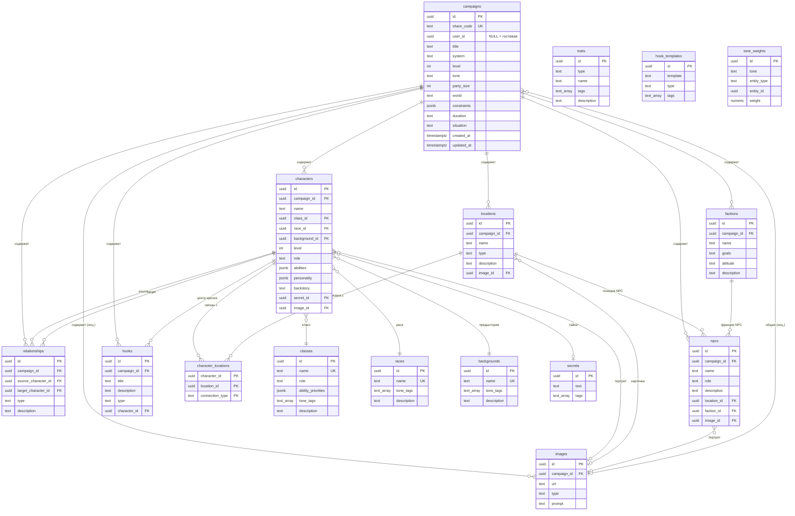

# ER-диаграмма PartyForge

```mermaid
erDiagram
    campaigns ||--o{ characters : "содержит"
    campaigns ||--o{ relationships : "содержит"
    campaigns ||--o{ locations : "содержит"
    campaigns ||--o{ factions : "содержит"
    campaigns ||--o{ npcs : "содержит"
    campaigns ||--o{ hooks : "содержит"
    campaigns ||--o{ images : "содержит (опц.)"

    characters ||--o{ relationships : "source"
    characters ||--o{ relationships : "target"
    characters ||--o{ character_locations : "связан с"
    characters ||--o{ hooks : "центр крючка"

    locations ||--o{ character_locations : "связана с"
    locations ||--o{ npcs : "локация NPC"
    factions ||--o{ npcs : "фракция NPC"

    characters }o--|| classes : "класс"
    characters }o--|| races : "раса"
    characters }o--|| backgrounds : "предыстория"
    characters }o--o| secrets : "тайна"
    characters }o--o| images : "портрет"

    locations }o--o| images : "картинка"
    npcs }o--o| images : "портрет"
    campaigns }o--o| images : "общее (опц.)"

    campaigns {
        uuid id PK
        text share_code UK
        uuid user_id "NULL = гостевая"
        text title
        text system
        int level
        text tone
        int party_size
        text world
        jsonb constraints
        text duration
        text situation
        timestamptz created_at
        timestamptz updated_at
    }

    characters {
        uuid id PK
        uuid campaign_id FK
        text name
        uuid class_id FK
        uuid race_id FK
        uuid background_id FK
        int level
        text role
        jsonb abilities
        jsonb personality
        text backstory
        uuid secret_id FK
        uuid image_id FK
    }

    relationships {
        uuid id PK
        uuid campaign_id FK
        uuid source_character_id FK
        uuid target_character_id FK
        text type
        text description
    }

    locations {
        uuid id PK
        uuid campaign_id FK
        text name
        text type
        text description
        uuid image_id FK
    }

    character_locations {
        uuid character_id PK
        uuid location_id PK
        text connection_type PK
    }

    factions {
        uuid id PK
        uuid campaign_id FK
        text name
        text goals
        text attitude
        text description
    }

    npcs {
        uuid id PK
        uuid campaign_id FK
        text name
        text role
        text description
        uuid location_id FK
        uuid faction_id FK
        uuid image_id FK
    }

    hooks {
        uuid id PK
        uuid campaign_id FK
        text title
        text description
        text type
        uuid character_id FK
    }

    images {
        uuid id PK
        uuid campaign_id FK
        text url
        text type
        text prompt
    }

    classes {
        uuid id PK
        text name UK
        text role
        jsonb ability_priorities
        text_array tone_tags
        text description
    }

    races {
        uuid id PK
        text name UK
        text_array tone_tags
        text description
    }

    backgrounds {
        uuid id PK
        text name UK
        text_array tone_tags
        text description
    }

    secrets {
        uuid id PK
        text text
        text_array tags
    }

    traits {
        uuid id PK
        text type
        text name
        text_array tags
        text description
    }

    hook_templates {
        uuid id PK
        text template
        text type
        text_array tags
    }

    tone_weights {
        uuid id PK
        text tone
        text entity_type
        uuid entity_id
        numeric weight
    }
```
